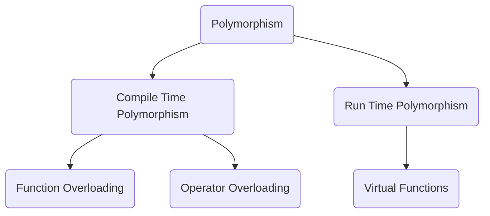
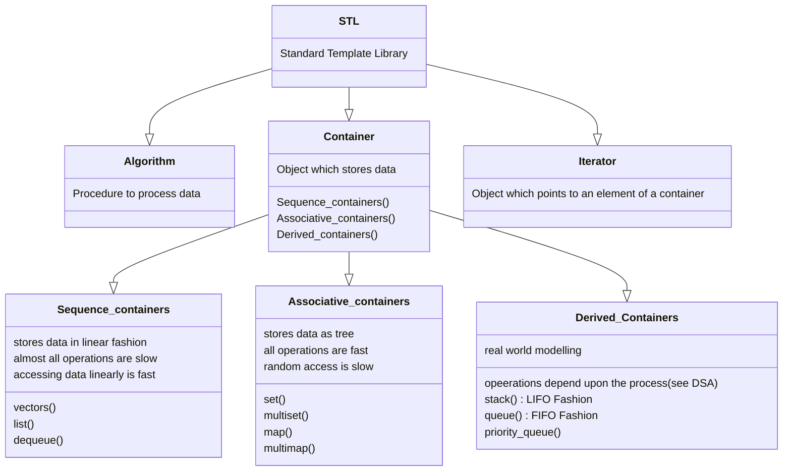

# NOTES Page
I have added notes based on the information which sometimes may miss from eyes. Or may be is very common.

## namespace std
So, I a program you can either use `using namespace std` just below `#include <iostream>`.<br>
Or, you can write `std::cout << "Sample Text"`. Both carry out the same task. But, I'll prefer the earlier.

## endl and \n
So, here's my finding that both `endl` and `\n` perform the same job that is to switch to next line. However, what I have thought is to use `\n` if I want to switch to new line in between texts. And, use `endl` when I'll want to end the  line. Also, keep in mind that, `cout` is incapable of going to new line as in JAVA i.e. `System.out.println()` 

## Confusion in LOCAL Var and GLOBAL Var (See var_conf.cpp)
A small information on it, that compiler identifies LOCAL and GLOBAL variables differently even if they have same name. Also, LOCAL vriable gets precedence over GLOBAL variable. [var_conf.cpp](data/var_conf.cpp)<br>
Additional information, what happens inside is, first the compiler checks locally if any variable named glo exists. If not it searchs for variable globally.

## Extraction and Insertion Operator
So, `<<` is *insertion* operator. And, `>>` is *extraction* operator. There is a huge confusing when trying to figure out what is what. But, a small trick used by me, insertion operator will insert the value to be displayed on screen. Add, extraction operator will extract the data after it is entered by the user.

## CPP Reference header files
[CPP Standard Header Files](https://en.cppreference.com/w/cpp/header)

## CPP Reference Precedence of Operators
[CPP Operator Precedence](https://en.cppreference.com/w/cpp/language/operator_precedence)

## Reserved Keywords
[Reserved Words](reserved.md)

## Data Types, Sizes and Range
[Data Type info](datatype_size.md)

## Pointers
While declaring pointers, `int* var_name` is samse as `int *var_name`. Do not confuse.

## Extra: Pointer to Pointer
To perform this task. Using the following snippet.
```
int a = 10;
int *b = &a;
int **c = &b;
```
## Pointer Arithmetic
Basic Formula : Address<sub>new</sub> = Address<sub>old</sub> + i  * sizeof(data type);
Ex. p + i = p + i * 4 {4 in case data type is `int`}

## Union
This is similar to structure. But, the only difference is, we can using only one variable declared withn it at any given time. This is to save space. And, to make the best use of storage avaliable.

## Inline Functions
When you call a function what happens is the program goes inside the function and then executes the function. Whereas, while using an inline function all that is skipped and the function is directly included durnig compilation of the program.
Syntax: `inline data_type fun_name ( parameters )`<br>
NOTE: Use inline functions for small codes such as products, sums, etc. Using inline functions for large functions will make your code inefficient as all the functions will take up space in the cache memory.<br>
Also, not every function becomes inline, optimization is done by compiler at its level.

## static keyword
When `static` keyword is used for any vaariable. Then, what happens is the device retains value of the variable when a program is running and it needs to exit and enter a function multiple times.

## const keyword
This keyword tells compiler that whatever value of variable is assigned must not chage at all costs. Doing so will produce an error.

## Friend Class

### Properties of friend class
1. Not in the scope of class, declaring anything as friend means it can access private mem
2. Since, it is not in the scope of the class, it cannot be called from the object of that class.
3. Can be invoked without the use of any object
4. Usually contains the objects in arguments
5. Can be declared in public as wel as private section of the class.
6. It cannot access the members directly by their names and need object_name.member_name to access any members.

### Syntax
1. To declare an independent function as friend. `friend data_type function_name ( parameters )`
2. To declare a function which is inside a class as friend. `friend data_type class_name :: function_name ( parameters )`
3. To declare an entire class as friend. `friend class class_name`

## Constructor
While working with constructors, if your code needs a constructor of a class for any use. Make sure to create a default constructor for the same class. Else, program will throw error.

## Inheritance
For, inheritance we require two or more classes. One that will inherit and the other which will be inherited. (Common Sense)<br>
### Visibility Modes
1. Private : This is the default visibility mode. In this private members as well as public members will be inherited and become private in derived class.
2. Public : In this only public memberd will be inherited. ANd, private members will be simply ignored.
Syntax:<br>
Base Class requires not additional syntax. It is normal as usual.<br>
Derived Class : `class class_name : visibility_mode base_class_name`<br>
Multi Class : `class class_name : visibility_mode _base_class_1, visibility_mode base_class_2`

## Access Specifiers
||Public Derivation|Private Derivation|Protected Derivation|
|-------|---------|----------|---------|
|Private Members|Not Inherited|Not Inherited|Not Inherited|
|Protected Members|Protected|Private|Protected|
|Public Members|Public|Private|Protected|

## Virtual Base Class
In normal inheritance what happens is, the member functions are always copied. But, using `virtual` what happens is member is copied down only once and that is when it is required when main function runs.

## More on Constructors
1. We can use constructors in derived classes in C++
2. If base class constructor does not have any arguments, there is no need of any constructor in derived class.
3. But if there are one or more arguments in the base class constructor, derived class need to pass arguments to the base class constructor.
4. If both base and derived classes have constructors, base class constructor is executed first.
5. In multiple inheritance, base classes are constructed in the order in which they appear in the class declaration.
6. In multilevel inheritance, the constructors are executed in order of inheritance.

### Special Syntax
1. C++ supports special syntax for passing arguments to multiple base classes.
2. The constructor of the derived class receives all the arguments at once and then will pass the calls to the respective base classes.
3. The body is called after all the constructors are finished executing.

```
Derived-Constructor (arg1, arg2, arg3, ...) : Base1-Constructor (arg1, arg2, ...), Base2-Constructor (arg1, arg2, ...)
{
    ...
} Base1-Constructor(arg1, arg2, ...)
```

### Special Case Virtual Base Class

1. The constructors for virtual base classes are invoked before an nonvirtual base class.
2. If there are multiple virtual base classes, they are invoked in the order declared.
3. Any non-virtual base class are then constructed before the derived class constructor is executed.

## Polymorphism



## Late Binding

`Late Binding : (Run time polymorphism) In this, the compiler adds code that identifies the kind of object at runtime then matches the call with the right function definition. This can be achieved by declaring a virtual function.`
[Late Binding Program](data/point_devclass.cpp)<br>
Pointer of base class can point to derived class. But, while calling functions, pointer will call base class functions. (see void display function).<br>
This is also known as late binding.A quesition arises, can we call derived class functions or can we access derived class variables ? The asnwer is NO. 

## Rules for Virtual Function

1. They cnnot be static
2. They can only be accessed by object pointers
3. They can be a friend of another class.
4. A function in base class might go unused.
5. If a virtual function is defined in the base class there is no need to define it in the derived class.

## File Handling

`#include <fstream>` <br>
The useful classes for working with files in CPP are :
1. fstreambase
2. ifstream --> derived from fstreambase
3. ofstream --> derived from fstreambse

In order to work with files, you will have to open it. There are two methods :-
1. Using constructor
2. Using the member function `open()` of the class

## Templates

Why use Templates ?<br>
We can use templates due to following reason: 
1. DRY - Don't Repeat Yourself Principle is not violated
2. Generic Programming
   
### See [Template Program](data/template_final.cpp) to know more about template.
### See [Multiple Parameter Template Program](data/multipara_template_final.cpp) to know more about template.
### See [Default Parameter Template Program](data/defpara_temp_final.cpp) to know more about template.

## Standard Template Library

### What is STL ?
It is a set of C++ template classes to provide common programming data structures and functions such as lists, stacks, arrays, etc. It is a library of container classes, algorithms, and iterators. It is a generalized library so its components are parameterized.
### Why use STL ?
When we use STL, we reuse well tested components. And, saves time. Its like using the wheel rather than reinventing the wheel.
### Components of STL
1. Containers -> Stores data, uses template classes. Moves as instructed by algorithms.
2. Algorithms -> Set of procedure that are used to manipulate data to reach a result.
3. Iteratos -> Object that points to an element in a container. Handled just like pointers. 

### Basics of STL
